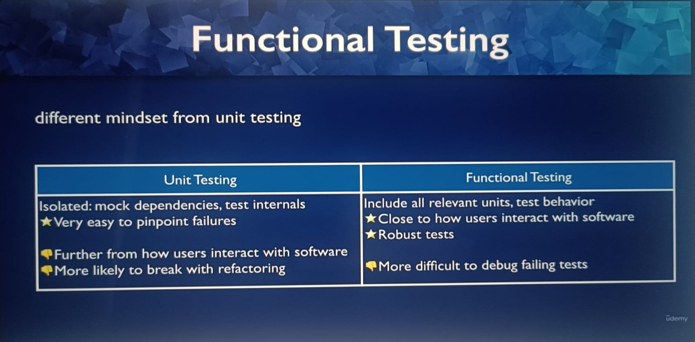
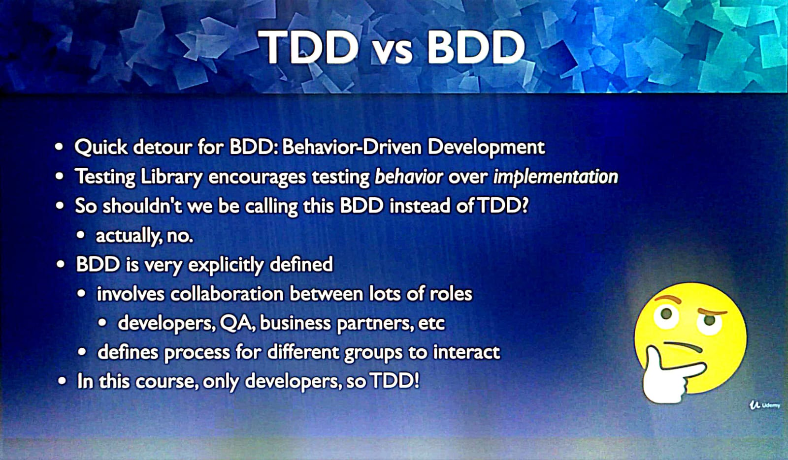

# React Testing Library

## TDD: (Test Driven Development)

1. First write code for component(minimum). Write functions declarations, not definitions.
2. Write unit tests for components, every test will fail initially.
3. Then start writing function definitions, and make evry test pass.

## React Testing Library philosophy:

### What it does:

1. Creates a virtual DOM.
2. Allows testing without a browser.

### Types of tests:

1. Unit tests: Testing a unit of code
2. Integration tests: Testing features
3. Functional tests: Testing behavior of functions when different inputs are given
4. Acceptance E2E (End to end) tests: Require browser. (e.g. Cypress, Selenium)

### Functional testing vs Unit testing:

### TDD vs BDD (Test driven dev and Behavior driven dev)

